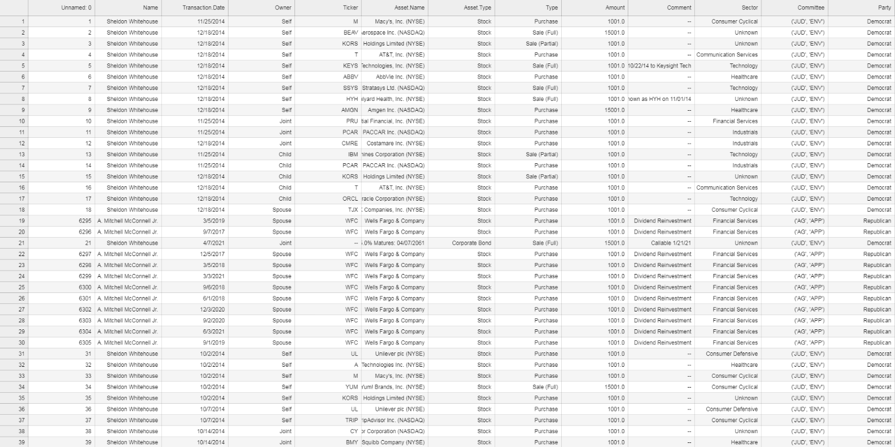
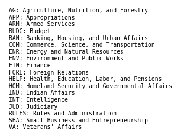
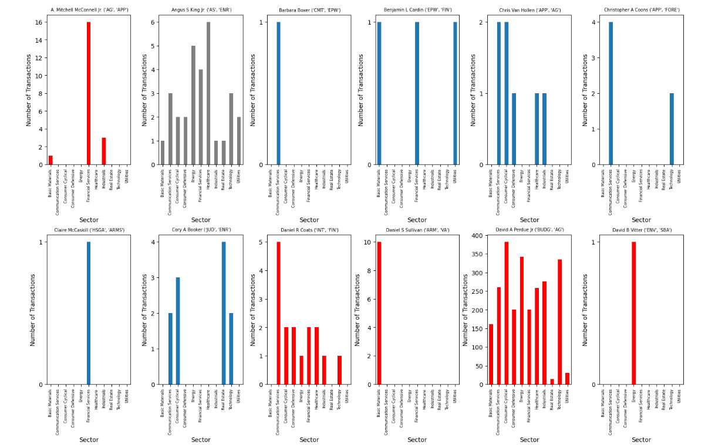
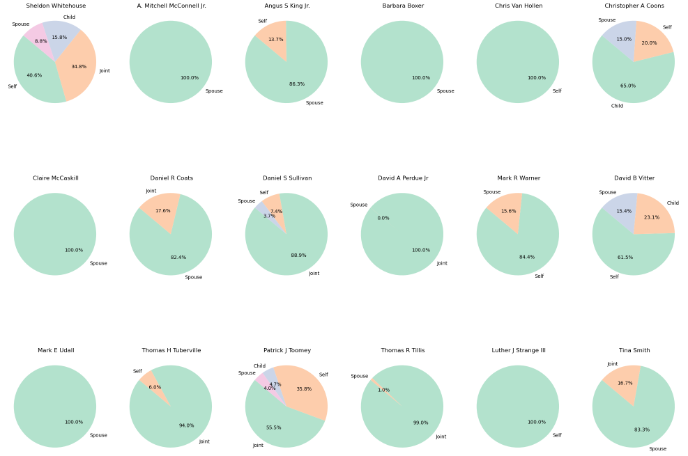
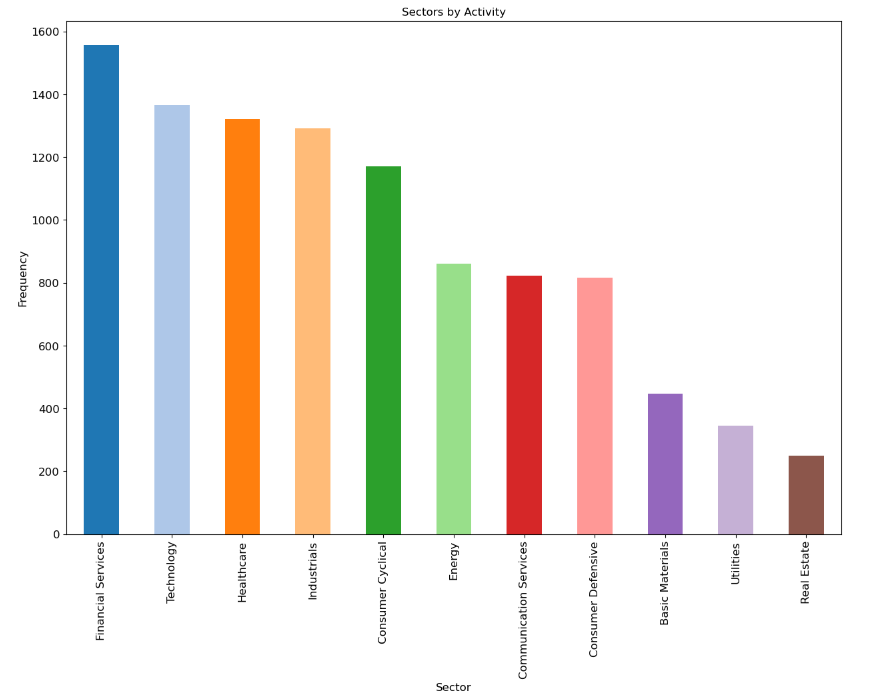
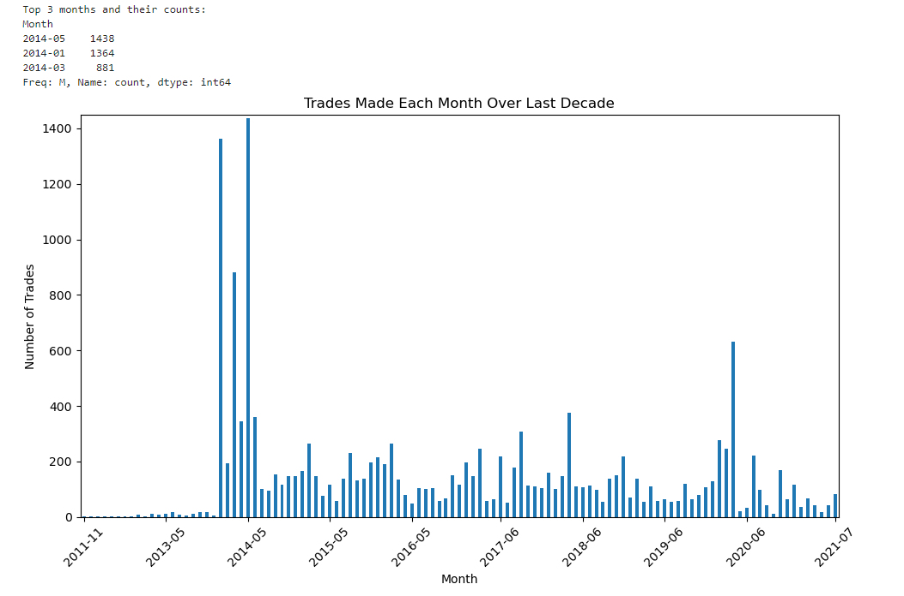
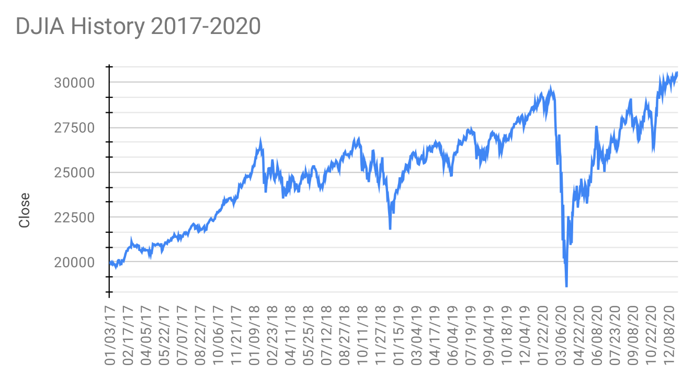

# U.S. Senator Stock Trading Analysis 📈

## Table of Contents

- Introduction
- Setup
- Exploration
- Plotting
- Findings
- Conclusion

## Introduction

According to the SEC, illegal insider trading is defined as:

"*The buying or selling of a security, in breach of a fiduciary duty or other relationship of trust and confidence, on the basis of material, non-public information about the security.*"

Because Congresspeople are directly involved in the lawmaking process, they are privy to uncommon knowledge that can assumedly have an immense impact on the stock market. 

To address these concerns, President Obama signed the Stop Trading on Congressional Knowledge Act (STOCK Act) into law in 2012, a measure proposed to ensure that those in Congress were not exempt from the same insider trading restrictions imposed on the rest of America. Congresspeople today are required to publicize all securities transactions within 45 days of the transaction date.

However, insider trading is an extremely difficult crime to [prove](https://www.sec.gov/news/speech/speecharchive/1998/spch221.htm#:~:text=Insider%20trading%20is%20an%20extraordinarily,of%20insider%20trading%20is%20rare), leading critics to doubt the law's effectiveness. In the past few years, congressional instances of suspicious trading have manifested in light of events like the COVID-19 pandemic and overseas conflicts like the Russia-Ukraine and Israel-Palestine situations.

This project aims to use basic data analysis techniques to extract insights about the nature of congressional trading over the last decade to determine insider trading is immediately obvious.

### Questions

### **1. Given a U.S. Senator, is there a connection between the committees they serve on and the sectors of their most traded stocks?**

### **2. Do Senators tend to use family members as means of executing their trades?**

### **3. Which sector(s) experiences the most activity overall? How does this look over time?**

The initial dataset was scraped using the Selenium and Pandas modules and can be found [here](https://www.kaggle.com/datasets/heresjohnnyv/congress-investments?resource=download).

## Setup

First, I had to cleanup the data. This involved getting rid of all private and/or non-stock transactions, since I was primarily concerned with advantages over the general public. I also wanted to append each stock's associated sector. To accomplish both, I used the Pandas and yfinance libraries to access stock information via Yahoo Finance.

```python
import pandas as pd
import yfinance as yf
```

Next, I wrote a function that took in a stock's ticker and retrieved its corresponding sector.

```python
def get_sector(ticker):
    try:
        stock = yf.Ticker(ticker)
        return stock.info['sector']
    except:
        return 'Unknown'

df['Sector'] = df['Ticker'].apply(get_sector)
```

Later, I can simply ignore any values labeled "Unknown" when performing analysis.

I also wanted to map each senator to their longest served committees to see if there was any relation between the stocks they invested in and their spheres of influence. I got abbreviations for each Senate committee and used ChatGPT to create a dictionary for future use by using the senators as keys and tuples containing their two longest-served committees and political parties as values. I then created functions similar to the "get_sector" function above and applied them accordingly.

## Exploration

The dataset now contained the following 12 columns:

1. Name
2. Transaction Date
3. Owner
4. Ticker
5. Asset Name
6. Asset Type
7. Transaction Type
8. Amount
9. Comments

Added separately:

10. Sector
11. Committee
12. Party



The CSV contained 15,666 total transactions, with Robert P. Corker Jr. and David A. Perdue Jr. being responsible for 24% and 22% of all of them, respectively. The most traded stock on the NASDAQ was AAPL. Other non-stock transactions included the trade of municipal securities (ex. bonds), options, and non-public stocks.

## Plotting

I imported the three basic data science libraries (numPy, Pandas, and Matplotlib) as well as my variables and functions from my other file.

```python
import pandas as pd
import numpy as np
import matplotlib.pyplot as plt
import matplotlib.dates as mdates   # date formatting
from matplotlib.ticker import MaxNLocator   # for ensuring integer tick values
from ipynb.fs.full.add_committees import committees, get_committee, get_party, legend_text
```

My first goal was to see what sector each senator traded within the most. This would allow me to see if there was any relation between that and their commmittees. The following snippet of code gets counts for the aforementioned relation and stores it as a DataFrame type:

```python
sector_counts = df[df['Sector'] != 'Unknown'].groupby(['Name', 'Sector']).size()unstack(fill_value = 0)
```

I then proceeded to make plots for each senator with the sector type on the x-axis and the frequency on the y-axis.

```python
fig, ax = plt.subplots()
ax.axis('off')

# add a committee-abbreviation legend for clarity
ax.text(0.1, 0.5, legend_text, va ='center', ha ='left', fontsize = 7, family = 'monospace')

plt.show()

# create subplots
num_senators = sector_counts.shape[0]
num_cols = 6
num_rows = (num_senators + num_cols - 1) // num_cols

fig, axes = plt.subplots(num_rows, num_cols, figsize = (15, 5 * num_rows), constrained_layout = True)
axes = axes.flatten()

# plot each senator's data in a subplot
for i, (senator, senator_data) in enumerate(sector_counts.iterrows()):
    
    if get_party(senator) == 'Republican':   # colours graphs according to political affiliation 
        senator_data.plot(kind='bar', ax = axes[i], color = 'red')    
    elif get_party(senator) == 'Independent':
        senator_data.plot(kind='bar', ax=axes[i], color = 'grey')
    else:
        senator_data.plot(kind='bar', ax = axes[i])

    axes[i].set_title(f'{senator} {get_committee(senator)}', fontsize = 7)
    axes[i].set_xlabel('Sector')
    axes[i].set_ylabel('Number of Transactions')
    axes[i].tick_params(axis = 'x', labelsize = 6, rotation = 90)
    axes[i].yaxis.set_major_locator(MaxNLocator(integer = True))  # ensures y-axis ticks are integers

# remove unused subplots
for j in range(i + 1, len(axes)):
    fig.delaxes(axes[j])

plt.show()
```




*(all plots not shown)*

Next, I wanted to visualize the percentage of stock trades made by the senator themselves vs. the percentage traded by family members.

```python
senators = df['Name'].unique()

for i, senator in enumerate(senators):

    senator_data = df[df['Name'] == senator]
    owner_counts = senator_data['Owner'].value_counts()   # count occurrences for each type

    owner_percentages = (owner_counts / owner_counts.sum()) * 100   # calculate percentages
    
    axes[i].pie(owner_percentages,   # create pi charts
                labels=owner_percentages.index,
                autopct='%1.1f%%',
                startangle=140,
                colors=plt.cm.Pastel2.colors)
    axes[i].set_title(f'{senator}')

for j in range(i+1, len(axes)):   # remove unused subplots
    axes[j].axis('off')

plt.tight_layout()
plt.show()
```



*(all plots not shown)*

The next plot disregards individual senators and displays each stock sector ordered by trading frequency.

```python
filtered_df = df[df['Sector'] != 'Unknown']

value_counts = filtered_df['Sector'].value_counts()   # gets counts for each sector

ax = value_counts.plot(kind='bar', 
                       title="Sectors by Activity", 
                       figsize = (15, 10), 
                       legend = False, 
                       fontsize = 12, 
                       color = plt.cm.tab20.colors)

ax.set_xlabel("Sector", fontsize = 12)
ax.set_ylabel("Frequency", fontsize = 12)

plt.show()
```



Finally, I decided to look at congressional trading patterns over the last decade to see what time period was the most active. I took the "Transaction Date" column and formatted its values. I also aggregated the data by month to reduce the granularity and improve understandability.

```python
dates_formatted = pd.to_datetime(df['Transaction.Date'], format='%m/%d/%Y')
df['Month'] = dates_formatted.dt.to_period('M')
monthly_counts = df['Month'].value_counts().sort_index()
```
The plot also needed to not include every date on the x-axis; otherwise, it would be too cluttered and visibility would be compromised.

```python
top_3_months = monthly_counts.nlargest(3)   # get the 3 highest months and their counts
print("Top 3 months and their counts:")
print(top_3_months)

plt.figure(figsize=(10, 6))
monthly_counts.plot(kind='bar')

plt.title('Trades Made Each Month Over Last Decade')
plt.xlabel('Dates')
plt.ylabel('Number of Trades')

num_ticks = 10   # set the x-ticks to be 10 evenly spaced ticks
ticks = np.linspace(0, len(monthly_counts) - 1, num_ticks, dtype = int)
plt.xticks(ticks, [monthly_counts.index[i].strftime('%Y-%m') for i in ticks], rotation = 45)
plt.ylim(0, monthly_counts.max() + 10)  # adjust y-axis limit for better visibility

plt.tight_layout()
plt.show()
```



## Findings

### Question 1

According to the "Sectors by Activity" graph, the three most invested in sectors were:

- 1st: Financial Services
- 2nd: Technology
- 3rd: Healthcare 

Related committees for each sector include

- Financial Services:
    - Senate Committee on Banking, Housing, and Urban Affairs (BAN)
    - Senate Committee on Finance (FIN)

- Technology:
    - Senate Committee on Commerce, Science, and Transportation (COM)
    - Senate Committee on Homeland Security and Governmental Affairs (HOM)
    - Senate Committee on the Judiciary (JUD)

- Healthcare:
    - Senate Committee on Health, Education, Labor, and Pensions (HELP)
    - Senate Committee on Finance (FIN)
    - Senate Committee on Appropriations (APP)

Because Financial Services encompassed such a wide range of stocks deemed generally reasonable for one's portfolio, it was difficult to justify the possibility of insider trading based on that factor alone. However, the senators with Senate Committee on Finance as their longest-served committee and Financial Services as their most traded sector included:

- Benjamin L. Cardin (FIN)
- Dean Heller (FIN, BAN)
- Patrick J. Toomey (FIN)
- Saxby Chambliss (FIN)
- and Thomas R. Carper (FIN)

Looking at the first plot alone, I also noted these observations when ignoring each senator's Financial Services investments:

- Patty Murray invested most into Healthcare as a member of HELP
- Thomas H. Tuberville (ARM, AG) had predominantly larger investments into Basic Materials and Technology. All other sectors were much lesser in comparison.
- Robert P. Corker and David A. Perdue Jr. (two most active traders in the dataset) had decently balanced portfolios given the sheer volume of their transactions.

### Question 2

As for the pie charts, it became apparent that the majority of senators conducted trades themselves. This was surprising to me because the Twitter-based stock trackers that initially piqued my interest in this topic usually accounted for the politician in question and their spouse when looking at portfolios.

### Question 3

The final plot is particularly interesting. The distribution is bimodal, with peaks occurring around early 2014 and early 2020. A U.S. News [article](https://www.usnews.com/news/articles/2014/12/30/2014-the-us-economys-breakout-year) from 2014 states that

"*Unemployment is now at the lowest rate since mid-2008. Despite the harsh winter weather that chilled economic growth at the start of the year, 2014 has been undoubtedly the strongest year of the U.S. labor market recovery yet. Driven by robust job gains, the American economy has sailed smoothly through this year as overseas economies stumble.*"

During the pandemic, the stock market experienced considerable volatility. However, the 2020 spike described above happened in March/April of 2020, right when the nationwide shutdowns were just beginning to be put into effect.



It is also worth noting at this point that the majority of actions (53%) taken in the dataset were stock purchases rather than sales. After the massive drop, we can see that congressional stock activity cooled drastically, indicating a widespread "hold and wait" movement.

## Conclusion

I decided that my findings were not enough to concretely render the U.S. senators in question guilty of insider trading. My descriptive statistics looked perfectly logical from a bird's eye view; portfolios were generally very well-rounded. However, I did not account for the timing of the purchases. Doing so would involve looking into every individual stock's growth over time, positive and negative news associated with them, and matching all that information to when the senators purchased their stock.

Using Financial Services' connection to the Finance Committee was a very basic and comprehensible example. In reality, the broadness of sectors and the encompassing influence of the Senate committees means that there can be a myriad of connections to the market invisible to the naked eye. Furthermore, my dataset did not account for the House of Representatives, a chamber with four times more politicians than the Senate.

That being said, based on my findings and personal beliefs, I do not believe the STOCK Act to be effective enough at what it claims.

**This project was independently pursued and is meant to be purely educational in nature.**